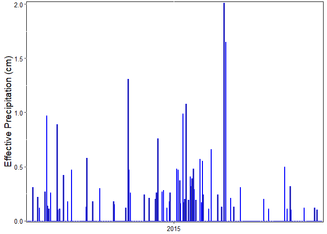
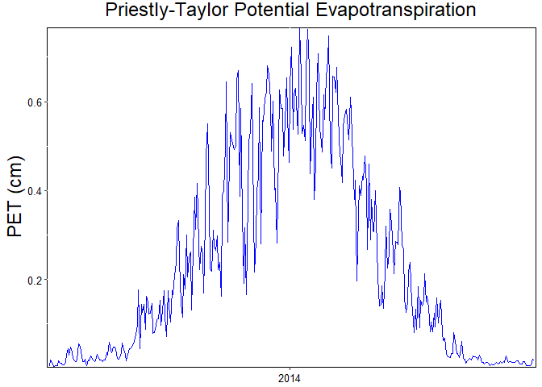
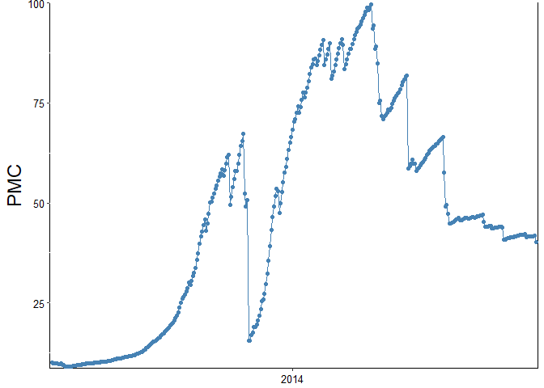
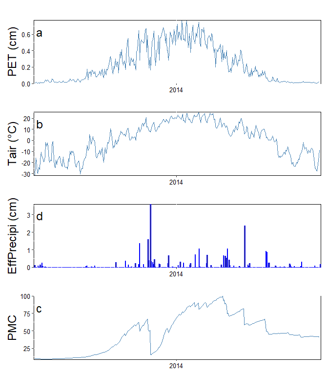

<!-- README.md is generated from README.Rmd. Please edit that file -->

# PMC

<!-- badges: start -->
<!-- badges: end -->

The PMC package provides tools to calculate the Peat Moisture Code
(PMC)—a daily moisture index designed specifically for peatland
ecosystems with deep organic soil profiles. PMC integrates effective
precipitation, evapotranspiration, and peat hydrological properties to
simulate subsurface moisture conditions relevant for fire danger rating,
drought monitoring, and ecological assessment.

The package includes:

\*Functions to prepare and standardize meteorological inputs

\*Tools to compute effective precipitation, PET, and daily PMC

\*Visualization utilities

\*Four example datasets from peatland-dominated regions in Canada

## Installation

You can install the development version of PMC from
[GitHub](https://github.com/) with:

``` r
# install.packages("devtools")
devtools::install_github("ElizabethArangoRuda/PMC")
```

## Example

Load the package:

``` r
library(PMC)
```

## Example datasets

The package includes four peatland meteorological datasets:

*Fort_McMurray.rda *Grande_Prairie.rda *Mildred_Lake.rda *Slave_Lake.rda

``` r
data("Mildred_Lake")
summary(Mildred_Lake)
#>       Date                 Tmin              Tmax              PPT         
#>  Min.   :2014-01-01   Min.   :-39.000   Min.   :-27.000   Min.   : 0.0000  
#>  1st Qu.:2014-07-02   1st Qu.:-14.150   1st Qu.: -4.800   1st Qu.: 0.0000  
#>  Median :2014-12-31   Median : -0.350   Median :  8.600   Median : 0.1000  
#>  Mean   :2014-12-31   Mean   : -3.141   Mean   :  7.406   Mean   : 0.9121  
#>  3rd Qu.:2015-07-01   3rd Qu.:  8.300   3rd Qu.: 20.600   3rd Qu.: 0.6000  
#>  Max.   :2015-12-31   Max.   : 18.800   Max.   : 34.000   Max.   :36.9000
```

## Preprocessing functions

clean_data()

Prepares input data for PMC calculations by standardizing column names
and formats. It is recommended to run this function before any other
PMC-related functions.

``` r
df <- clean_data(Mildred_Lake)
#> The 'PET' column is missing. You can calculate it using the 'PETpt()' function.
#> Missing values in 'PPT' column have been replaced with 0.
#> No missing values found.
#> Note: 'PPT' and 'PET' values must be in centimeters (cm). If your data is in millimeters (mm), please use the 'mm_to_cm()' function to convert it.
#> Data processed successfully with 730 rows and 4 columns.
```

mm_to_cm()

Converts selected variables from millimeters (mm) to centimeters (cm) by
multiplying by 0.1.

``` r
?mm_to_cm
#> ℹ Rendering development documentation for "mm_to_cm"
df <- mm_to_cm(df, columns = "PPT")
#> The following column(s) were successfully converted from millimeters to centimeters: PPT
#> You can now compute effective precipitation using the `eff_ppt()` function.
```

eff_ppt()

Calculates effective precipitation, representing the portion of
precipitation that contributes to peat moisture storage (after
subtracting negligible rainfall events). The threshold argument defines
the minimum precipitation to be considered effective.

``` r
?eff_ppt
#> ℹ Rendering development documentation for "eff_ppt"
df <- eff_ppt(df, column = "PPT_cm", threshold = 0.1, year_to_plot = "2015")
#> Effective precipitation was calculated using a threshold of 0.1
#> You can now compute potential evapotranspiration using the `PETpt()` function.
```

 PETpt()

Computes daily potential evapotranspiration (PET) using the
Priestley–Taylor method, a simplified alternative to the Penman–Monteith
equation suitable for peatland environments.

``` r
?PETpt
#> ℹ Rendering development documentation for "PETpt"
df <- PETpt(df,
  latitude = 65.2825,
    alpha = 1,
    y = 0.063,
    Gsc = 0.0820,
    lambda = 2453,
    a = 0.17,
    b = 0.59,
    year_to_plot = "2014")
#> PET calculation completed successfully. You may now proceed with PMC estimation using the `PMC()` function.
```



## Computing the Peat Moisture Code (PMC)

The PMC() function calculates the daily Peat Moisture Code using a
water‐balance approach that integrates effective precipitation and
actual evapotranspiration. PMC increases during drying periods and
decreases when water storage is replenished.

``` r
?PMC
#> ℹ Rendering development documentation for "PMC"
df <- PMC(df,
    PET_column = "PET",
    A = 0.8674,
    B = 0.0540,
    start_PMC = 10,
    C = 0.15, # C = 0.1
    Sy_min = 0.1,
    PMC_min = 0.1,
    year_to_plot = "2014")
#> PMC was calculated successfully. If your dataset includes ISI, you can now proceed with the PMC_ISI calculation using the PMCISI() function.
```

 \## Visualization
utilities

The package includes visuals(), a helper function to produce a
four-panel figure summarizing key hydrometeorological variables.

``` r
?PMC
#> ℹ Rendering development documentation for "PMC"
df <- visuals(df,
    var1 = "PET",
    var2 = "Tavg",
    var3 = "PMC",
    var4 = "eff_Precip_cm",
    x_label_vr1 = "PET (cm)",
    x_label_vr2 = "Tair (°C)",
    x_label_vr3 = "PMC",
    x_label_vr4 = "Effective Precipitation (cm)",
    year_to_plot = "2014"
  )
```


